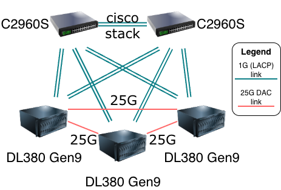

# High-Availability Kubernetes Cluster

This project automates the deployment of a high-availability Kubernetes cluster on Proxmox VE using Talos Linux, with distributed storage via LINSTOR and routing via FRR.

> **Note**: This configuration is tailored to my specific lab setup. Feel free to fork, submit patches, or ask questions if you'd like to adapt it for your environment.

## Network Topology



The cluster architecture features:
- **LACP connection to switches** with inter-switch links for redundancy
- **Redundant uplinks** from each server to both switches (data/management network)
- **Direct inter-server connections** for storage replication (LINSTOR) and cluster communication

## What It Does

### [Ansible](https://github.com/ansible/ansible)

Configures Proxmox VE infrastructure nodes with:

- **System Management**
  - System package upgrades
  - Custom package installation
  - `/etc/hosts` configuration with loopback IPs
  - NTP time synchronization

- **Networking**
  - FRR (Free Range Routing) configuration for advanced routing
  - Network interface configuration (Proxmox-specific)
  - Netplan configuration (Rocky Linux)

- **Storage**
  - LINSTOR distributed storage setup
  - DRBD-based storage pools
  - Proxmox storage integration

- **Proxmox Integration**
  - Terraform/OpenTofu API user and token creation
  - Proxmox API permissions configuration

### [OpenTofu](https://github.com/opentofu/opentofu)

Creates and manages Kubernetes VMs:

- **VM Provisioning**
  - Talos Linux ISO download and distribution
  - VM creation with configurable resources (CPU, memory, disk)
  - Multi-node VM deployment across Proxmox cluster

- **VM Configuration**
  - Cloud-init integration
  - Network device configuration
  - Disk and storage management
  - BIOS/UEFI boot configuration

- **Talos Integration (wip)**
  - Talos machine configuration templates (controlplane/worker)
  - Cluster endpoint configuration
  - Kubernetes networking (pod/service subnets)

## Where to Adjust for Your Cluster

### Ansible Configuration

1. **`ansible/inventory.yaml`**
   - Update hostnames (Default: `dl380-1`, `dl380-2`, `dl380-3`)
   - Set `ansible_host` addresses
   - Configure `lo_ip` (loopback IPs) and `net` (network identifiers)

2. **`ansible/group_vars/all.yaml`**
   - Network settings: `frr_interface_1/2`, `gateway_ip`, `netmask_cidr`
   - Proxmox API credentials: `api_host`, `api_user`, `api_token_id`, `api_token_secret`
   - Talos version and schematic ID
   - VM parameters: `k8s_vm.count`, `k8s_vm.core_count`, `k8s_vm.memory_size`, `k8s_vm.disk_size`
   - LINSTOR settings: `linstor_place_count`

### OpenTofu Configuration

1. **`opentofu/provider.tf`**
   - Update `proxmox_ve_endpoint` and `proxmox_ve_api_token` variables
   - Adjust SSH key path (`~/.ssh/id_ed25519`)
   - Update node names and addresses in the `ssh.node` blocks

2. **`opentofu/main.tf`**
   - VM configuration (currently creates VMs with Talos ISO)
   - Uncomment and configure Talos machine configuration resources if needed

3. **`opentofu/controlplane.yaml` and `opentofu/worker.yaml`**
   - Talos machine configuration files
   - Update cluster endpoint IP (`cluster.controlPlane.endpoint`)
   - Adjust cluster name, pod/service subnets, and other Kubernetes settings

## How to Run

### Prerequisites

- Ansible installed
- OpenTofu (or Terraform) installed
- SSH access to Proxmox nodes
- Proxmox API token configured

### Ansible Setup

```bash
cd ansible
ansible-galaxy install -r requirements.yaml
ansible-playbook main.yaml -i inventory.yaml
```

### OpenTofu Setup

```bash
cd opentofu
tofu init
tofu apply
```

### Destroy Infrastructure

```bash
cd opentofu
tofu destroy
```

```bash
cd ansible
ansible-playbook destroy.yaml -i inventory.yaml
```

## Future Plans / TODO

- **Configure Talos ISO**: Automate Talos ISO configuration and installation
- **Add Secure Boot**: Enable UEFI Secure Boot support for VMs
- **Unified Configuration**: Create an Ansible role that auto-generates OpenTofu variables and runs Terraform, establishing a single source of truth for all configuration (including Proxmox Terraform API token)